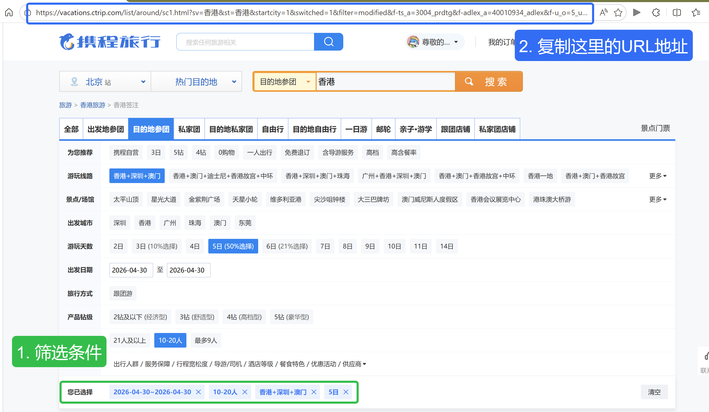

# zhangxiaoshuai_skill

我的个人 skill 分享集合。技能基于标准 SKILL.md 格式，兼容 Claude Code、OpenClaw（龙虾）等所有支持 skill 机制的 AI Agent。

## 技能列表

| 技能 | 说明 |
|------|------|
| [ctrip-compare](#ctrip-compare) | 携程跟团游产品快速对比分析 |

---

## 使用方法

### 方式一：ClawHub 安装（推荐）

技能已发布到 [ClawHub](https://clawhub.ai/zhangxiaoshuai98)，所有兼容 Agent 均可一键安装：

```bash
# 安装 ClawHub CLI
npm i -g clawhub

# 搜索并安装技能
clawhub install ctrip-compare
```

### 方式二：手动安装

将技能目录复制到对应 Agent 的 skills 目录：

```bash
# Claude Code
cp -r ctrip-compare ~/.claude/skills/

# OpenClaw（龙虾）
cp -r ctrip-compare ~/.openclaw/skills/
```

安装后在对话中输入相关指令即可触发技能。


---
# skill具体的使用方法

## ctrip-compare

从携程跟团游产品页面自动提取数据，压缩摘要，并根据用户偏好生成对比分析文档。

### 功能

- 支持产品详情页 URL 和搜索列表页 URL 两种输入
- 自动提取：标题、价格、评分、供应商、完整行程
- 子 Agent 并行压缩摘要，支持 50+ 产品批量处理
- 根据用户偏好维度（景点、酒店、预算、拍照服务等）针对性对比
- 输出结构化 Markdown 对比文档

### 前置依赖

1. **Python 3.8+**

2. **Playwright**

   ```bash
   pip install playwright
   ```

3. **Chromium 系浏览器**（Chrome / Edge / Brave 均可），启动时需开启 CDP 调试端口：

   ```bash
   # Chrome
   chrome --remote-debugging-port=9222

   # Edge
   msedge --remote-debugging-port=9222
   ```

### 使用方式

支持两种使用方式，根据你的需要选择：

#### 方式一：搜索列表页批量分析

1. 打开携程跟团游页面 [https://vacations.ctrip.com/grouptravel](https://vacations.ctrip.com/grouptravel)
2. 搜索目的地并进行筛选（出发城市、出行天数、价格区间等）
3. 筛选完成后，复制浏览器地址栏中的 URL，发给 Agent 即可



```
分析这个搜索页的产品：https://vacations.ctrip.com/list/...
```

Agent 会自动提取列表页中所有产品的详细数据并生成对比分析。

#### 方式二：指定产品详情页对比

如果你已经看好了几个具体的跟团游产品，直接将它们的详情页 URL 发给 Agent：

```
帮我对比这几个携程产品：
https://vacations.ctrip.com/tour/detail/p30642209s34
https://vacations.ctrip.com/tour/detail/p64166362s34
```

### 注意事项

- Windows 用户如遇 `python3` 命令不存在，请使用 `python` 代替
- 提取价格前需确认出发日期，不同日期价格可能差异较大
- 浏览器需提前启动并开启 `--remote-debugging-port=9222`

### 文件结构

```
ctrip-compare/
├── SKILL.md           # 技能定义与工作流程
└── scripts/
    ├── search.py      # 搜索页产品 URL 提取
    └── extract.py     # 产品详情数据提取
```

## License

MIT
