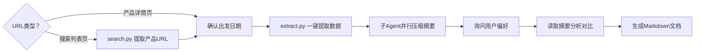

# 携程跟团游产品对比分析

## 流程概览



## 用户使用指南

当用户询问"怎么用"、"如何使用"时，根据以下内容回答。

### 前置依赖

1. **Python 3.8+**
2. **Playwright**：`pip install playwright`
3. **Chromium 系浏览器**（Chrome / Edge / Brave 均可）

### 使用方式

#### 方式一：搜索列表页批量分析

1. 打开携程跟团游页面 https://vacations.ctrip.com/grouptravel
2. 搜索目的地并进行筛选（出发城市、出行天数、价格区间等）
3. 筛选完成后，复制浏览器地址栏中的 URL，发给 Agent 即可

示例：
```
分析这个搜索页的产品：https://vacations.ctrip.com/list/...
```

Agent 会自动提取列表页中所有产品的详细数据并生成对比分析。

#### 方式二：指定产品详情页对比

如果已经看好了几个具体的跟团游产品，直接将它们的详情页 URL 发给 Agent：

```
帮我对比这几个携程产品：
https://vacations.ctrip.com/tour/detail/p30642209s34
https://vacations.ctrip.com/tour/detail/p64166362s34
```

### 注意事项

- 浏览器需提前以调试模式启动：`chrome --remote-debugging-port=9222`（或 `msedge` / `brave`）
- Windows 用户如遇 `python3` 命令不存在，请使用 `python` 代替
- 提取价格前需确认出发日期，不同日期价格可能差异较大

## 跨平台注意

- **Windows 用户**：命令中 `python3` 请替换为 `python`
- **浏览器**：支持 Chrome / Edge / Brave 等所有 Chromium 系浏览器

## 浏览器管理

### 提取前：检查 CDP 端口

运行 extract.py 或 search.py 前，**必须先检查 CDP 端口 9222 是否可用**：

```bash
# 检查端口是否可用
curl -s http://localhost:9222/json/version
```

- **返回 JSON（含 Browser 名称）**：浏览器已正确启动，可继续
- **连接失败**：浏览器未按指定端口启动，需要处理（见下方）

### 浏览器未正确启动时的处理

当 CDP 端口 9222 连接失败时，**先检测用户本地安装了哪些浏览器**，再向用户提问：

```
⚠️ 浏览器未以调试模式启动（CDP 端口 9222 不可用）。

检测到您本地安装了：[检测到的第一个浏览器]

是否可以使用 [检测到的第一个浏览器] 重新启动？如果您同意，我会帮您：
1. 终止该浏览器的所有进程（含后台残留）
2. 以调试模式重新启动

或者您希望手动操作？
```

**自动处理流程**（确认后执行）：

1. **终止该浏览器的所有进程**（含后台残留）。根据当前操作系统和目标浏览器，使用对应的 kill 命令。仅终止选中的浏览器，不要影响其他浏览器
2. **等待 2 秒**，确保进程完全退出、端口释放
3. **以调试模式重新启动**该浏览器，指定 `--remote-debugging-port=9222` 参数。根据操作系统和浏览器类型使用对应的启动命令
4. **验证端口已启动**：`curl -s http://localhost:9222/json/version`

> **重要**：必须先 kill 指定浏览器的所有进程再重启。仅关闭窗口不够，后台进程可能仍在运行，导致新启动的浏览器无法绑定 9222 端口。

**用户选择手动操作时**，给出指引：

1. 彻底关闭浏览器（关闭窗口不够，后台进程可能仍在），可通过命令行终止或任务管理器结束所有该浏览器进程
2. 重新以调试模式启动浏览器，添加 `--remote-debugging-port=9222` 参数
3. 验证：`curl -s http://localhost:9222/json/version`

### 提取后

无需额外操作（Playwright 通过 CDP 直连，不启动额外进程）

## Step 1：判断URL类型

用户提供的URL有两种类型，处理方式不同：

| URL类型 | 匹配规则 | 处理方式 |
|---------|---------|---------|
| 搜索列表页 | `vacations.ctrip.com/list/` 开头 | 先运行 `search.py` 提取产品URL，再进入 Step 2 |
| 产品详情页 | `vacations.ctrip.com/tour/detail/` 或 `vacations.ctrip.com/travel/detail/` | 直接进入 Step 2 |

如果是搜索列表页，运行 `search.py` 提取产品URL：

```bash
# 从搜索页提取产品URL（默认第一页所有产品，最多100条）
python3 ~/.claude/skills/ctrip-compare/scripts/search.py "<搜索页URL>"

# 指定最多提取N条（上限100）
python3 ~/.claude/skills/ctrip-compare/scripts/search.py "<搜索页URL>" --max 20
```

脚本会输出提取到的产品URL列表（每行一个），将这些URL作为后续步骤的输入。

**注意**：search.py 运行完毕后，浏览器标签页已关闭，可直接继续运行 extract.py，无需重启浏览器。

## Step 2：确认出发日期

如果用户没有给出出发日期，**必须先询问**：

```
请问你打算哪天出发？出发日期会用来查询每个产品当天的真实价格（不同日期价格可能差异很大）。
```

只有确认出发日期后，才开始提取数据。

## Step 3：一键提取数据

使用 Python 脚本 `scripts/extract.py`，通过 Playwright 直连浏览器 CDP 接口，一次性提取所有 URL 的数据。

### 前置条件

- 浏览器已启动（Chrome/Edge/Brave 等 Chromium 浏览器，带 `--remote-debugging-port=9222`）
- Playwright 已安装（`pip install playwright`）

### 运行命令

```bash
# 运行提取脚本
python3 ~/.claude/skills/ctrip-compare/scripts/extract.py <出发日期> <输出目录> <url1> <url2> ...
```

**示例**：
```bash
python3 ~/.claude/skills/ctrip-compare/scripts/extract.py 30 ~/ctrip/ctrip_20260430_云南/raw \
  https://vacations.ctrip.com/tour/detail/p30642209s34 \
  https://vacations.ctrip.com/tour/detail/p64166362s34 \
  https://vacations.ctrip.com/tour/detail/p68251626s34
```

### 脚本工作原理

对每个 URL 依次执行：
1. 通过 CDP 连接已运行的浏览器，打开新标签页
2. 等待页面加载完成（`h1` 出现 + 3s 额外等待）
3. 点击日历上的出发日期，获取真实价格
4. 从页面提取：标题、产品ID、价格、评分、供应商
5. 提取完整行程（图文行程模式 `DIV.daily_itinerary_item`）
6. 保存为纯文本文件到 `raw/` 目录
7. 关闭标签页，处理下一个 URL

### 提取失败处理

- **连接失败**：检查浏览器是否启动、CDP 端口 9222 是否可用
- **价格提取失败**：脚本会使用页面默认价格
- **行程提取失败**：检查输出文件中行程部分是否为空，可能需要手动补充

## Step 4：并行压缩摘要

> **必须使用子 Agent（Agent tool）执行压缩任务，严禁在主 Agent 中执行。**
>
> 原因：压缩需要读取大量原始文件，在主 Agent 中执行会导致上下文窗口爆炸（即使不超限，长上下文也会导致后续分析质量显著下降）。子 Agent 有独立的上下文空间，不影响主对话质量。
>
> **如果子 Agent 遇到问题无法完成**，向用户说明情况并给出选项：
> 1. 在主 Agent 中继续执行（需告知：会导致上下文膨胀，后续分析质量可能下降）
> 2. 手动操作或其他方式
>
> 由用户决定，不要擅自选择。

原始文件每个约 400-500 行，10 个产品约 4500 行 / 165KB。直接全部读入会占用大量上下文（约 50K tokens）。通过子 Agent 并行压缩，压缩后仅约 9%（每个产品 ~40 行），支持一次性读入分析。

### 目录结构

```
~/ctrip/
├── <项目名>/
│   ├── compare_<项目名>.md     ← 最终对比分析文档
│   ├── summary/                ← 压缩摘要（分析时读取）
│   │   ├── p30642209_summary.txt
│   │   └── ...
│   └── raw/                    ← 原始数据（用户追问细节时读取）
│       ├── p30642209.txt
│       └── ...
└── <另一个项目名>/
    └── ...
```

**项目名动态生成**，格式：`ctrip_<日期>_<目的地简称>`
- 示例：`ctrip_20260430_云南大理丽江`
- 目的地简称从产品标题中提取
- 项目根目录默认 `~/ctrip/`，如用户指定了其他位置则使用用户的
- 如果用户指定了项目名，则使用用户指定的

### 压缩策略

使用子 Agent 并行压缩，每个 Agent 处理 4-10 个文件，最多同时 5 个 Agent：

| 文件数量 | Agent 数量 | 每个 Agent 处理 |
|----------|-----------|----------------|
| 1-4 | 1 | 全部 |
| 5-10 | 2 | 3-5 |
| 11-20 | 3 | 4-7 |
| 21-40 | 4 | 5-10 |
| 41-50 | 5 | 8-10 |

超过 50 个文件时，等第一批完成后再开启新批次。

### Agent 压缩指令模板

```
你是数据压缩助手。请读取以下N个携程旅游产品原始数据文件，将每个文件压缩为结构化摘要。

原始文件：
1. ~/ctrip/<项目名>/raw/pXXXXX.txt
2. ...

压缩规则（保留所有有效信息，去除噪音）：

保留：
- 文件头（标题、产品ID、价格、评分、供应商、URL）
- 每天的日程标题
- 景点/场馆名称 + 门票状态（含/不含/免）
- 活动体验详情（旅拍、换装、扎染、骑行等，**必须完整保留**：时长、是否含妆造、是否含服装/几套、精修数量、底片数量、是否含航拍）
- 酒店名称 + 房型 + 钻级星级（如"4钻"/"5星"）
- 餐食含/不含（用 ✓/× 表示）
- 交通方式（动车/大巴/飞机等）
- 集合/解散信息（接机/送机）
- 重要备注（如索道停运方案）

去除：
- "Day\n\n01" 等碎片排版
- 推荐餐厅的详细地址、人均、菜品
- "温馨提示"大段注意事项
- "行驶时间：约60分钟" 等通用交通描述
- 营销文案
- "成人：不含餐 儿童：不含餐\n自理" 重复格式
- 通用模板文字
- Day1 自由活动的推荐景点列表（旅游团当天无安排，无需列出建议去哪里）

输出格式（每个文件独立）：
===== pXXXXX 摘要 =====
标题: ...
价格: ¥XXXX/人 | 评分: X/XX条 | 供应商: ...
URL: ...

Day1: 【日程标题】...
  交通: ...
  景点: xxx(含门票) | yyy(免)
  活动: 旅拍30min(含妆造,航拍,精修3张)
  餐食: 早✓ 午× 晚×
  酒店: xxx/yyy/zzz(海景房)
  备注: 重要注意事项

保存到 ~/ctrip/<项目名>/summary/pXXXXX_summary.txt
```

### 压缩后效果

- 原始：~500行/文件 → 摘要：~40行/文件（约 8% 体积）
- 10 个产品：4500 行 → 400 行（约 15K tokens，轻松一次性读入）
- 50 个产品：约 2000 行（约 60K tokens，仍在可接受范围）
- 原始文件保留在 `raw/` 目录，用户追问细节时可随时读取

## Step 5：询问用户偏好

数据提取和压缩完毕后，向用户询问：

```
数据已提取完毕，共N个产品。请问您有哪些特别看重的方面？

- 🏔️ 风景点（哪些景点必须有？）
- 📸 拍照/旅拍（精修？妆造？航拍？）
- 🏨 酒店等级（3钻/4钻/5钻？）
- 💰 预算范围
- 🎭 特色体验（千古情/扎染/游艇等）
- 👥 团队大小偏好
- 🚗 交通偏好（动车/商务车）
- 其他偏好？

（可以说"都看"或列出优先级）
```

## Step 6：分析对比（读取摘要文件）

用 `read` 工具读取 `summary/` 目录下的压缩摘要文件，一次性全部读入后分析：

- **景点是否真正包含**：区分"行程中的景点"和"历史介绍中提及"
- **旅拍服务的具体内容**：精修数量、是否含妆造、是否含航拍
- **价格的真实含义**：起价 vs 专享券后价格 vs 自费项目
- **行程安排的质量**：是否合理、是否走回头路、自由活动时间

用户追问某个产品的细节时，再到 `raw/` 目录读取该产品的原始数据。

### 对比维度

| 维度 | 数据来源 |
|------|----------|
| 价格 | 脚本提取的点击日期后真实价格 |
| 景点覆盖 | 摘要中的景点条目（逐天） |
| 拍照服务 | 摘要中的活动体验详情 |
| 酒店等级 | 摘要中的酒店条目 |
| 特色体验 | 日程标题中的关键词 |
| 口碑 | 评分 + 点评数 |
| 去重 | 比较不同产品的行程是否完全相同 |

## Step 7：生成 Markdown 文档

使用 Write 工具，将最终对比分析保存为 Markdown 文件。

**输出路径**：`~/ctrip/<项目名>/compare_<项目名>.md`

**文档结构**：

```markdown
# 携程跟团游产品对比分析

> 出发日期：YYYY-MM-DD | 分析时间：YYYY-MM-DD HH:mm

## 筛选说明
- 数据来源、出发日期、筛选条件

## 价格总览
| 产品 | 价格 | 评分 | 团队 | 酒店 | 链接 |
|------|------|------|------|------|------|
| ... | ... | ... | ... | ... | ... |

## 用户关注维度对比
- 根据用户偏好针对性对比

## 景点覆盖对比
| 景点 | 产品A | 产品B | 产品C |
|------|-------|-------|-------|
| ... | ✓/✗ | ✓/✗ | ✓/✗ |

## 综合推荐 TOP 3
1. **产品名** — 推荐理由 + 产品链接
2. ...
3. ...

## 详细行程对比
（逐天对比各产品行程安排）
```

### 注意事项

- 价格标注"出发日期对应的实时价格，仅供参考"
- 产品链接使用完整URL
- 用 `> **提示**` 或 `> **⚠️**` 标注重要提示
- 评分参考价值提示（点评太少的不够可靠）
- 每次调用技能会在同一项目目录下生成：`raw/` 子目录存放过程资料，根目录存放最终 md
